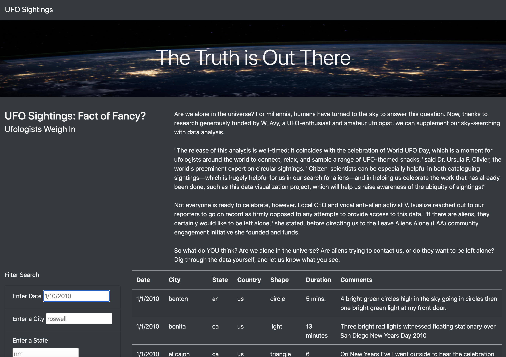
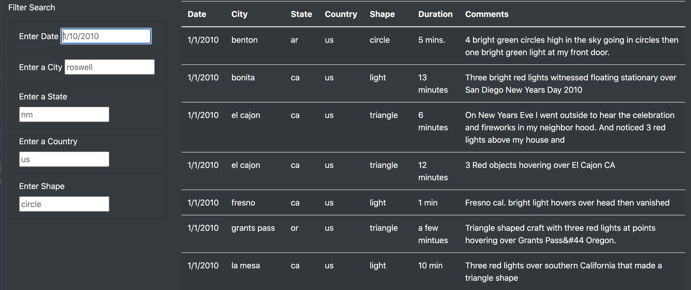
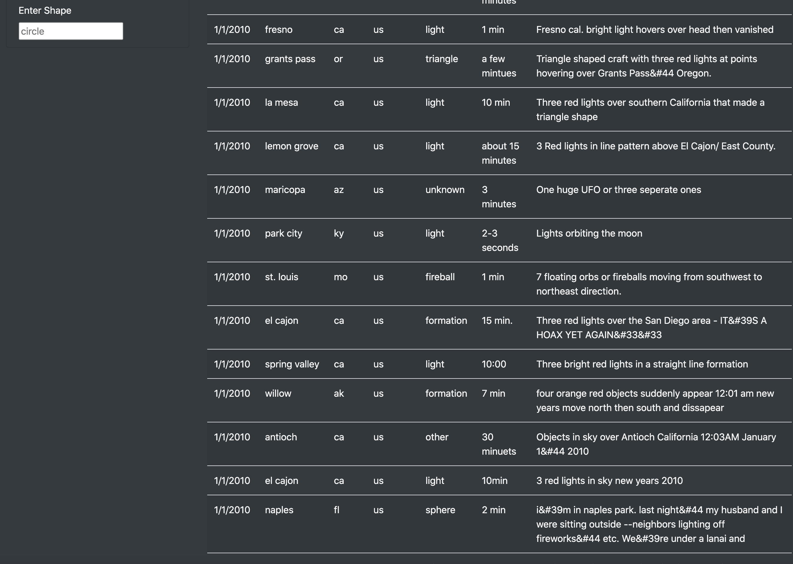
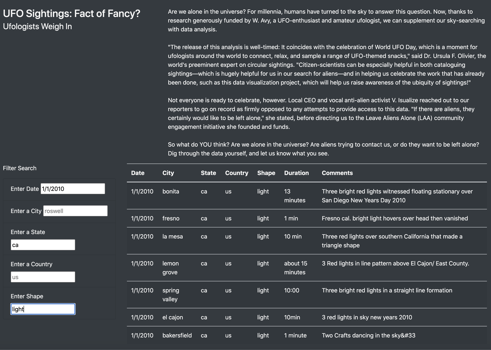

# UFOs

## Overview of Project: 

Dana, a journalist is writing about her hometown of McMinnville, Oregon, which is famous for it's high nmber of alleged UFO sightings. 

The only lead she had for her story was a large Javascript file filled with many UFO sighting data from around the world, with various descriptions of those encounters. 

Dana's goal became to create an interactive webpage that allows readers to parse the data around UFO sightings. So, she essentially needed to build two things: 

    - the webpage that will allow users to view the data (with HTML) and;
    - a dynamic table that will present it (with JavaScript).
    
Using JavasScript, we orignally structured the site to display and filter that data in a table based on a users search of a specific date. We later came to the realization however that we could filter the data even more based on the following criteria;
   
    * City
    * State
    * Country
    * Shape (of the UFO sighting) 

We decided it would benefit potential users to be able to filter data based on these criteria as well as the date, so we restructed our code in our HTML.index and app.js file so that they would be able to do so. 

## Resources

* Data Source: data.js 

### Software:

* Python 3.6.1
* Javascript
* HTML

# Results: 

Above is an image of the site we created as it would look to someone visiting the page. They are greated with a nice header, a blurb about what the site is about, and description of what they can do on the site. 

Futher below that is our various data filters and table where the data is displayed (see the image below to get a closer look.  

With our newly added filters, a user can search the data more specifically than by date alone.

For example, whereas before if a user wanted to find out about sightings on 1/1/2010, the number of filtered results is 34, with a wide variety of cities and sighting shape type (as seen in our image below).

However, with our new filters, users can get more specific to narrow down the amount of data shown in our table, as seen below when we add "ca" for our state filter, and "light" to our Shape filter (see below). 

# Summary: 

While our page is much more search friendly than our previous effort, some drawbacks from its design in its current state are;
    
    * It's still a tad boring as a site overall.  
    * The our data only covers the month of January in 2010, but nowhere on our page do we specify that. 
    * There is a "duration" criteria in our table but we don't have a filter for that due to the lack of uniformity in our      
      original data.js file. 
    * There is also a "comment" criteria, but the information in it is very lacking. 
    
In order to address these issues, I would recommend the following to enhance our page further. 

    * Think of some more dynamic ways enhance the overall design of our page
    * Until we get more/new data added to our data.js file, specify on our page the timeline of searchable dates so users don't
      assume our page contains ALL recorded UFO sightings. 
    * Clean up the "duration" data and add a filter for this as well. 
    * For the "comment" criteria, perhaps adding a link to any online articles related to these sightings so users can easily   
      access more information on them. 
    
    
    
    
